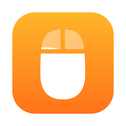
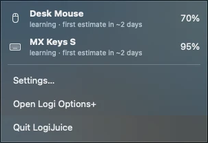
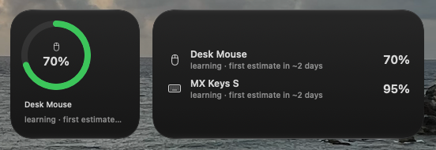

<p align="center"></p>

<h1 align="center">logijuice</h1>
<p align="center"><strong>Battery levels and low-battery alerts for Logitech mice and keyboards on a Logi Bolt receiver.</strong></p>
<p align="center">A menu bar app for macOS, with a widget and a command-line tool. macOS's own battery menu doesn't show these devices.</p>

<p align="center">
  <a href="https://github.com/Land-o-Clusters/logijuice/releases/latest"></a>
  
  
  
</p>

<p align="center">
  <a href="#features">Features</a> ·
  <a href="#supported-hardware">Supported hardware</a> ·
  <a href="#install">Install</a> ·
  <a href="#command-line">Command line</a> ·
  <a href="#uninstall">Uninstall</a> ·
  <a href="#privacy">Privacy</a>
</p>

> [!IMPORTANT]
> logijuice is unofficial and not affiliated with or endorsed by Logitech. "Logitech", "Logi Bolt", "Unifying" and
> "Logi Options+" are trademarks of Logitech.

<p align="center">
  
  &nbsp;
  
</p>

## Features

- The menu bar icon is the outline of your lowest device, a mouse or a keyboard, filled to its battery level. By default it shows up only while a battery is low or charging. Pin a device in Settings to keep it in the menu bar.
- Alerts escalate, and you can rename, retime or turn off each level. Low (20%) waits up to 8 hours for a natural break like a screen lock or sleep, and also alerts at the end of your day or when your hub moves to another Mac ("Leaving this desk?"). Very low (10%) and Critical (5%) alert right away, and Critical repeats daily until you charge.
- The forecast learns how fast each device drains and shows the time left, such as "~9 days". The first estimate takes about two days of use.
- After three full charges, Settings shows an estimated battery health, worked out from how long each charge lasted because the receiver doesn't report capacity or charge cycles.
- Small and medium widgets work on the desktop and in Notification Center.
- Readings sync through your own iCloud Drive, so a Mac without the receiver still shows recent values. Only the Mac that has the receiver sends alerts.
- logijuice reads battery information and never changes a device setting, so it runs alongside Logi Options+.
- For scripts, there is `logijuice status --json` and two Shortcuts actions, Get Device Battery and Get Lowest Battery.

## Supported hardware

| Receiver | Status |
|---|---|
| Logi Bolt (`C548`) | Tested with MX Keys S and MX Master 3S |
| Unifying (`C52B`, `C532`) | Same protocol, not yet tested |
| Lightspeed, for gaming devices (`C539`, `C53A`, `C53D`, `C53F`, `C541`, `C545`, `C547`) | Not yet tested |

A device works if it reports its battery through HID++ feature 0x1004 (percentage), 0x1000 or 0x1001. Feature 0x1001
reports a voltage, which logijuice converts to a percentage with a typical lithium-ion curve. G-series mice often use
it, and that path is untested. Devices without any of the three, such as some gaming headsets and older AA models,
show "battery not reported". Bluetooth connections aren't handled, because macOS already shows those devices.

To help test a receiver or device marked untested, run `logijuice debug capture --seconds 30 --probe` and attach the
file to an issue. logijuice removes your devices' serial numbers and unit IDs from the file before writing it.

## Install

LogiJuice needs macOS 14 or later.

### Download

Get `LogiJuice-0.1.0.zip` from the [latest release](https://github.com/Land-o-Clusters/logijuice/releases/latest),
unzip it and move LogiJuice.app to Applications. The app isn't notarized by Apple, so macOS blocks the first launch.
Open it once, then click Open Anyway in System Settings → Privacy & Security. macOS also blocks the `logijuice` command
inside the app until you do.

### Homebrew

```sh
brew tap Land-o-Clusters/logijuice https://github.com/Land-o-Clusters/logijuice
brew install --cask logijuice
```

The same Open Anyway step applies on first launch.

### Build from source

You need a full Xcode install. A build made on your own Mac launches without the Open Anyway step.

```sh
export DEVELOPER_DIR=/Applications/Xcode.app/Contents/Developer
swift test
scripts/build-app.sh
cp -R dist/LogiJuice.app /Applications/
open /Applications/LogiJuice.app
```

## Command line

```sh
ln -sf /Applications/LogiJuice.app/Contents/Resources/bin/logijuice /usr/local/bin/logijuice
logijuice status          # MX Master 3S: 42%, ~9 days
logijuice status --json
logijuice devices
logijuice debug capture --seconds 30 --probe   # raw HID++ frames, for bug reports
```

## Uninstall

Quit LogiJuice from its menu and delete `/Applications/LogiJuice.app`. Its data is in
`~/Library/Application Support/logijuice/` and, if sync was on, `iCloud Drive/logijuice/`.

## Privacy

logijuice doesn't send telemetry or open network connections. Its data stays in
`~/Library/Application Support/logijuice/` and, when sync is on, in your own `iCloud Drive/logijuice/`.

## License

MIT. See [LICENSE](LICENSE).
